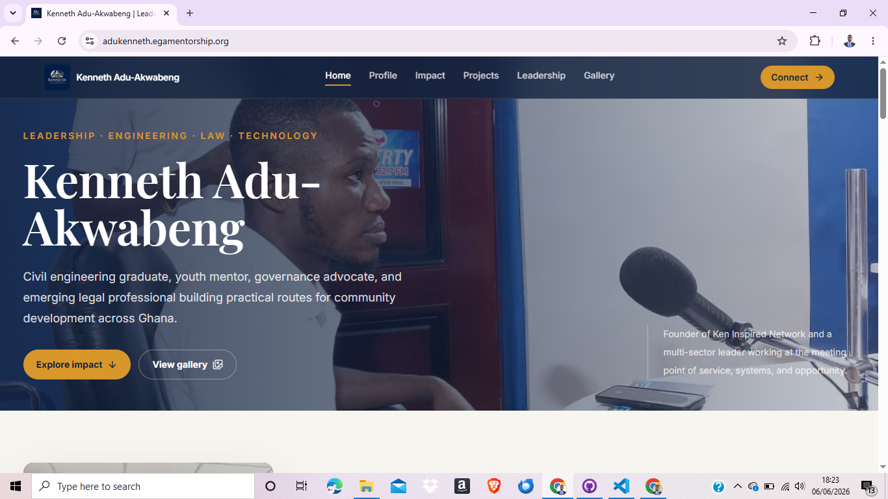
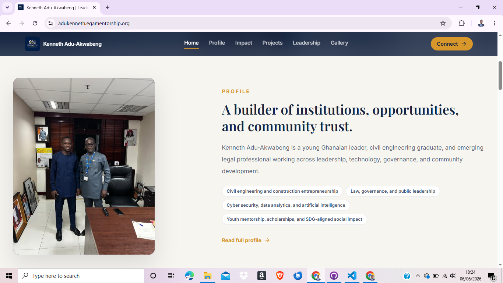
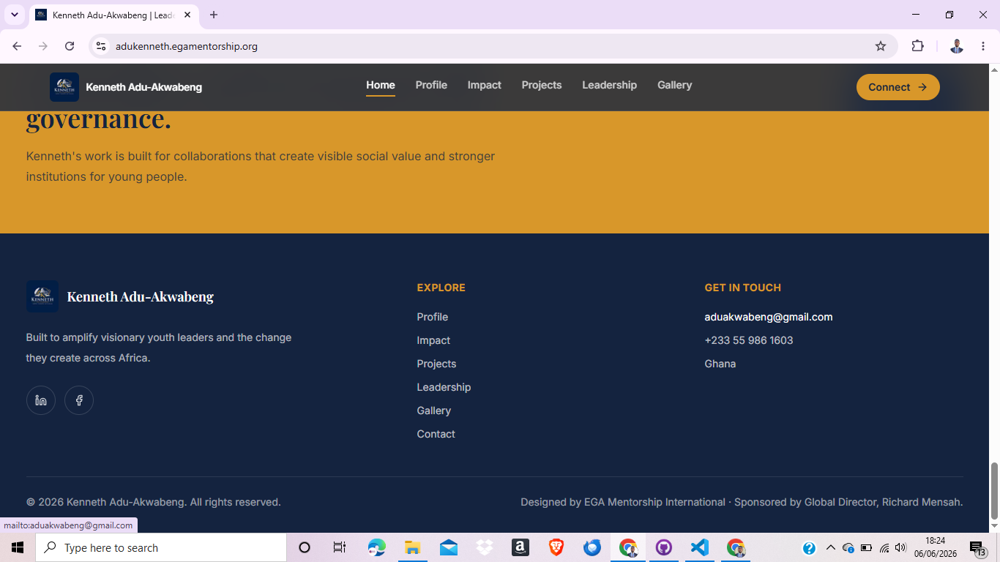

# Kenneth Adu-Akwabeng — Personal Website

A modern, multipage personal brand website for **Kenneth Adu-Akwabeng** — a young Ghanaian leader, civil engineering graduate, emerging legal professional, and Founder of **Ken Inspired Network**.

🌍 **Live:** [adukenneth.egamentorship.org](https://adukenneth.egamentorship.org)

Built with Next.js (App Router), React, TypeScript, and Tailwind CSS. The design uses a **navy + gold** identity drawn from Kenneth's logo, with elegant serif headings (Playfair Display) over a clean sans-serif body (Inter).

---

## 📸 Screenshots

### Home — Hero


### Home — Profile teaser


### Footer — contact & credits


---

## ✨ Features

- **Navy & gold brand theme** matching the logo, with cream backgrounds and a refined editorial feel.
- **Fully responsive** with a dedicated **mobile menu** (hamburger) so every page is reachable on phones.
- **Multipage structure** — Home, Profile, Impact, Projects, Leadership, Gallery, Contact — each with distinct content (no repeated blocks).
- **Home page teasers** that preview each section and link to the full pages.
- **Cinematic photo marquee** — auto-scrolling rows of curated images that pause on hover (respects reduced-motion).
- **Auto-generated gallery** — drop photos in a folder and they appear, auto-categorized.
- **Real contact page** — clickable email, phone, WhatsApp, location, social links, and a message form.
- **Prev/next journey navigation** guiding visitors through the whole site.
- **SEO ready** — Open Graph + Twitter cards, `Person` structured data (JSON-LD), `robots.txt`, `sitemap.xml`, and a logo favicon.
- **Downloadable CV** button.

---

## 🛠 Tech Stack

| Area | Technology |
|------|------------|
| Framework | [Next.js 15](https://nextjs.org/) (App Router) |
| UI | [React 19](https://react.dev/) + TypeScript |
| Styling | [Tailwind CSS v4](https://tailwindcss.com/) |
| Icons | [lucide-react](https://lucide.dev/) |
| Fonts | Playfair Display (serif) + Inter (sans) via `next/font` |

---

## 🎨 Design System

Defined in [`tailwind.config.ts`](tailwind.config.ts) and [`app/globals.css`](app/globals.css).

| Token | Hex | Use |
|-------|-----|-----|
| `navy` | `#14233f` | Primary dark — headings, dark sections, footer |
| `navy-700` | `#1d3357` | Cards / hover on navy |
| `gold` | `#d8972a` | Accent — buttons, eyebrows, highlights |
| `gold-soft` | `#e7b85c` | Hover / lighter gold |
| `cream` | `#f7f5ef` | Page background |
| `slate` | `#5b6b85` | Muted / secondary text |

> Legacy class names (`ink`, `paper`, `moss`, `saffron`, `clay`) are kept as aliases that map to the palette above, so older utility classes still render in-theme.

---

## 📁 Project Structure

```
app/
  layout.tsx          # Root layout, fonts, SEO metadata, JSON-LD
  page.tsx            # Home (hero + teasers + marquee + contact CTA)
  profile/            # Profile page
  impact/             # Impact page (stats + pillars)
  projects/           # Projects page (grid + areas of work)
  leadership/         # Leadership page (roles + CV)
  gallery/            # Full photo gallery
  contact/            # Contact details + form
  robots.ts           # robots.txt generator
  sitemap.ts          # sitemap.xml generator
  icon.png            # Favicon (auto-served by Next.js)
  apple-icon.png      # Apple touch icon

components/
  layout/             # Navbar (with mobile menu), Footer, PageNav
  ui/                 # SectionHeader, StatCard, PageHeader
  features/
    home/             # Hero, teasers, ProfileSection, FieldMarquee, ContactBand …
    impact/           # ImpactPillars
    projects/         # ProjectAreas
    contact/          # ContactDetails, ContactForm

constants/index.ts    # ALL editable content (bio, stats, roles, projects, contact …)
lib/gallery.ts        # Reads /public/images/gallery and categorizes photos
lib/utils.ts          # cn() class helper
types/index.ts        # Shared TypeScript types
public/images/gallery # Gallery photos
public/logo.png       # Logo used in navbar/footer
public/kenneth-adu-akwabeng-cv.pdf  # CV download
```

---

## 🚀 Getting Started

Requires Node.js 18+.

```bash
# install dependencies
npm install

# run the dev server (http://localhost:3000)
npm run dev

# production build
npm run build

# start the production server
npm start
```

---

## ✏️ Editing Content

Almost all text lives in **[`constants/index.ts`](constants/index.ts)** — no need to touch components.

| Constant | Controls |
|----------|----------|
| `PROFILE_INTRO` | Bio paragraphs on the Profile page |
| `FOCUS_AREAS` | The focus-area chips/cards |
| `STATS` | The 3 impact stat cards (value, label, detail) |
| `IMPACT_PILLARS` | The four "Areas of impact" cards |
| `IMPACT_HIGHLIGHTS` | The impact highlights list |
| `ROLES` | Leadership roles (title, organization, sector, period) |
| `PROJECTS` | Featured project cards (title, category, description, image) |
| `PROJECT_AREAS` | The "Areas of work" grid on the Projects page |
| `CONTACT` | Email, phone, WhatsApp number, location |
| `SOCIALS` | Social media links (LinkedIn, Facebook, …) |
| `MISSION` / `CREDIT` | Footer mission line and credit |

### Update contact details
Edit the `CONTACT` and `SOCIALS` objects in `constants/index.ts`. The contact form automatically uses `CONTACT.email`; if no real email is set it falls back to WhatsApp using `CONTACT.whatsapp`.

### Manage the gallery
Drop image files into **`public/images/gallery/`**. They're picked up automatically and sorted/named by prefix. Category labels are mapped in [`lib/gallery.ts`](lib/gallery.ts):

```
bibiani-donation-*    → Bibiani Orphanage Donation
bitim-school-project-*→ BITIM School Construction
cleanup-ashiam-*      → Ashiam Community Clean-Up
kenneth-leadership-*  → Leadership & Public Engagement
nugs-farm-*           → NUGS Farm Initiative
youth-engineering-*   → Youth in Engineering Forum
```
To add a new category, add a prefix → label entry in `lib/gallery.ts`.

### Replace the CV
Replace **`public/kenneth-adu-akwabeng-cv.pdf`** with the real CV (keep the same filename) — the "Download professional CV" button picks it up automatically.

### Replace the logo / favicon
Update `public/logo.png` (navbar/footer) and `app/icon.png` + `app/apple-icon.png` (favicon). Keep them square.

---

## 🔍 SEO

- Metadata, Open Graph, Twitter card, and `Person` JSON-LD are configured in [`app/layout.tsx`](app/layout.tsx).
- The canonical site URL defaults to `https://adukenneth.egamentorship.org`. Override per environment with `NEXT_PUBLIC_SITE_URL`.
- `robots.txt` and `sitemap.xml` are generated automatically.
- After deploying, submit the site + sitemap to [Google Search Console](https://search.google.com/search-console) so it appears in search results (and the favicon shows next to it).

---

## 🌐 Deployment

The site is a static-friendly Next.js app and can be deployed to Vercel, Netlify, or any Node host. Set the environment variable for correct SEO URLs:

```
NEXT_PUBLIC_SITE_URL=https://adukenneth.egamentorship.org
```

---

## 🙌 Credits

Designed by **EGA Mentorship International** · Sponsored by Global Director, **Richard Mensah**.

> *Built to amplify visionary youth leaders and the change they create across Africa.*

© 2026 Kenneth Adu-Akwabeng. All rights reserved.
